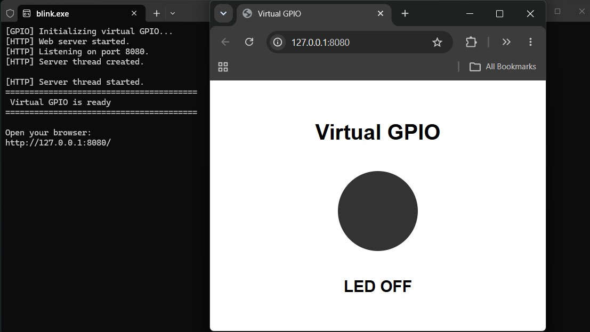

# Embedded-DevOps-Template


A reusable development template for building, testing, and validating embedded firmware with reproducible toolchains and automated CI/CD workflows.


The project separates application code from platform and runtime implementations, allowing the same application to be built and tested across different embedded targets and host environments.


## Project Status


The first working cross-platform milestone is complete.


Currently implemented:


- CH559L bare-metal firmware target
- Windows host-based firmware target
- Ceedling unit testing with Unity and CMock
- Dockerized SDCC toolchain for CH559L
- CMake-based build configuration
- Ninja build system
- MinGW-w64 Windows cross-compilation
- GitHub Actions integration
- Automated firmware artifact generation
- Firmware artifacts published through GitHub Releases
- Virtual GPIO implementation for Windows


## Architecture


The project separates the application layer from platform and runtime implementations.


```text
                         Application
                              │
                         apps/blink
                              │
                ┌─────────────┴─────────────┐
                │                           │
             CH559L                       Windows
                │                           │
          Platform GPIO               Virtual GPIO
                │                           │
          CH559L Hardware              HTTP Server
                │                           │
                └─────────────┬─────────────┘
                              │
                           Runtime
```
The application itself does not contain platform-specific GPIO or timing implementation.

For example, the application uses:

```C code
gpio_init();


led_on();


delay_ms(1000);


led_off();


delay_ms(1000);
```

The implementation of these interfaces is provided by the selected platform and runtime.

## Build and Test Flow

The project uses the same application source while selecting different platform implementations.

### CH559L
```
Application
    │
    ▼
Ceedling Unit Tests
    │
    ▼
CMake
    │
    ▼
Ninja
    │
    ▼
Docker / SDCC
    │
    ▼
CH559L Firmware
    │
    ├── firmware.hex
    ├── firmware.bin
    └── firmware.ihx
```

The generated firmware has been programmed and validated on real CH559L hardware.

### Windows

The same Blink application can also be built as a Windows executable.

```
Application
    │
    ▼
Ceedling Unit Tests
    │
    ▼
CMake
    │
    ▼
Ninja
    │
    ▼
MinGW-w64
    │
    ▼
blink.exe
```

The Windows target implements the GPIO interface as a virtual GPIO.

The virtual LED is exposed through a minimal HTTP server:

```
blink.exe
    │
    ▼
Virtual GPIO
    │
    ▼
HTTP Server
    │
    ▼
http://127.0.0.1:8080/
```

This provides a simple host-based representation of the embedded GPIO without requiring physical hardware.



## Toolchain and Build Environments

The project uses isolated environments where reproducibility provides a practical benefit.

### CH559L

The CH559L target uses a Dockerized SDCC toolchain.
```
Docker
 └── SDCC
      └── CH559L / MCS-51
```

### Windows

The Windows build environment uses:

```
Ubuntu
 ├── CMake
 ├── Ninja
 └── MinGW-w64
```

The build environment is provided as a Docker image, allowing Windows hosts to build the target without installing CMake, Ninja, or MinGW-w64 directly on the host system.

## Unit Testing

Unit tests are implemented using:

- Ceedling
- Unity
- CMock

Platform-specific dependencies are mocked during unit testing, allowing application logic to be tested independently from the target hardware.

The current Blink application has an automated unit test executed before the firmware build.


## Continuous Integration

GitHub Actions is used to automate testing and build verification.

The CI pipeline is designed to:

1. Run unit tests
1. Configure the build using CMake
1. Build using Ninja
1. Generate target artifacts
1. Publish build artifacts and releases

The goal is to keep the local development workflow and CI workflow reproducible and consistent.

## Repository Structure
```
.
├── apps/
│   └── blink/
│
├── platforms/
│   ├── ch559l/
│   └── windows/
│
├── platform-runtimes/
│   ├── ch559l/
│   └── windows/
│
├── runtimes/
│   └── baremetal/
│
├── build-targets/
│   ├── ch559l-baremetal/
│   └── windows/
│
├── cmake/
│
└── .github/
    └── workflows/
```

The repository is intentionally organized around reusable application, platform, runtime, and build-target components.

## External Components

The CH559 platform currently uses CH559.h, derived from:

https://github.com/atc1441/CH559sdccUSBHost

Original author: atc1441

Original license: GNU General Public License v3.0 (GPL-3.0)

This third-party component retains its original licensing terms and is not relicensed under this repository's MIT License.

## Releases

The first firmware release is available here:

https://github.com/SafdariAli/Embedded-DevOps-Template/releases

The release contains the generated CH559L firmware artifacts.

## Roadmap

The project is being developed incrementally toward a complete embedded DevOps workflow.

Planned areas include:

- Additional embedded platforms
- Additional firmware examples
- Static analysis
- Code coverage
- Automated artifact management
- Hardware-in-the-loop testing
- RTOS-based targets
- 32-bit microcontroller workflows
- FPGA development workflows

## License

This project is licensed under the MIT License unless otherwise stated.

Third-party components retain their respective licenses.
